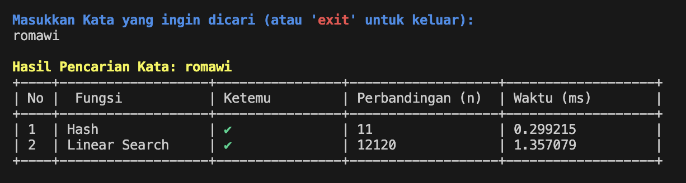
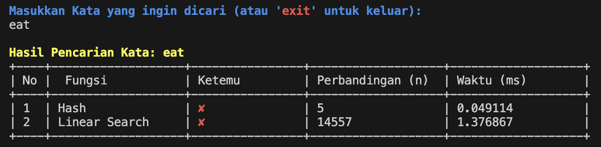

# Optimalisasi Penyimpanan dan Pencarian Kata pada Kamus Bahasa Indonesia Menggunakan Fungsi Hash Berbasis Teori Bilangan




Proyek ini merupakan implementasi program dari makalah Matematika Diskrit dengan judul "Optimalisasi Penyimpanan dan Pencarian Kata pada Kamus Bahasa Indonesia Menggunakan Fungsi Hash Berbasis Teori Bilangan"

## Persyaratan

Pastikan Anda telah menginstal Python di sistem Anda.

## Langkah Instalasi

1. Clone repository proyek ini:
   ```bash
   git clone https://github.com/AlfianHanifFY/AplikasiFungsiHash-Matdis.git
   ```
2. Masuk ke direktori proyek:
   ```bash
   cd KoreksiKata---ALGEO-IF2123
   ```

## Cara Penggunaan

1. Pastikan semua persyaratan telah dipenuhi.
2. Jalankan file `main.py`:
   ```bash
   python main.py
   ```

## Dataset

Dataset awal yang digunakan adalah file `data.txt`, yang didapat dari repository berikut:
[https://github.com/damzaky/kumpulan-kata-bahasa-indonesia-KBBI](https://github.com/damzaky/kumpulan-kata-bahasa-indonesia-KBBI).

## Kontributor

- **Nama**: Alfian Hanif Fitria Yustanto
- **NIM**: 13523073
